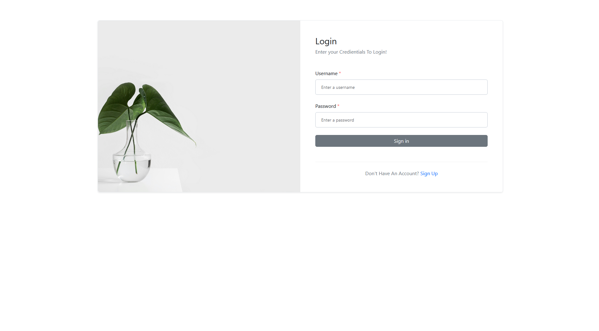
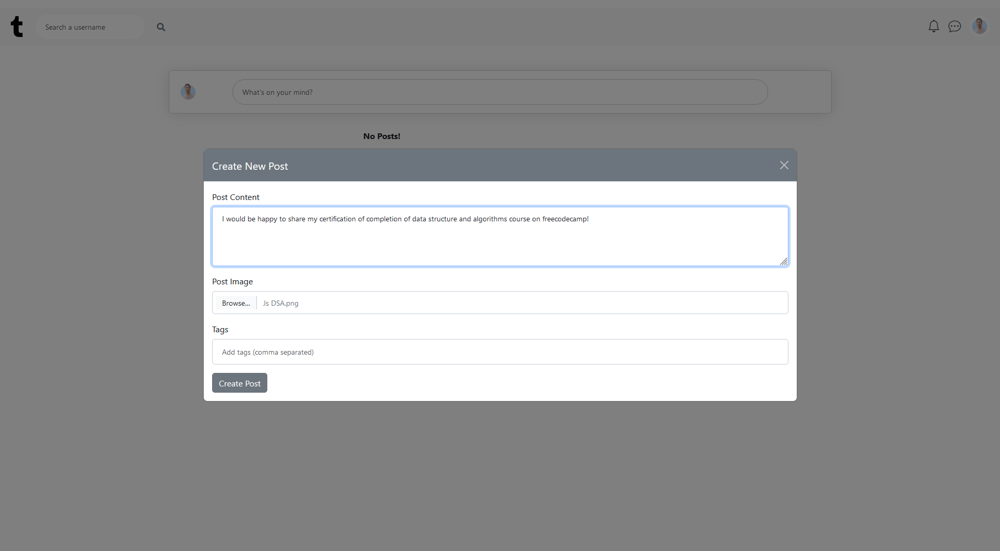
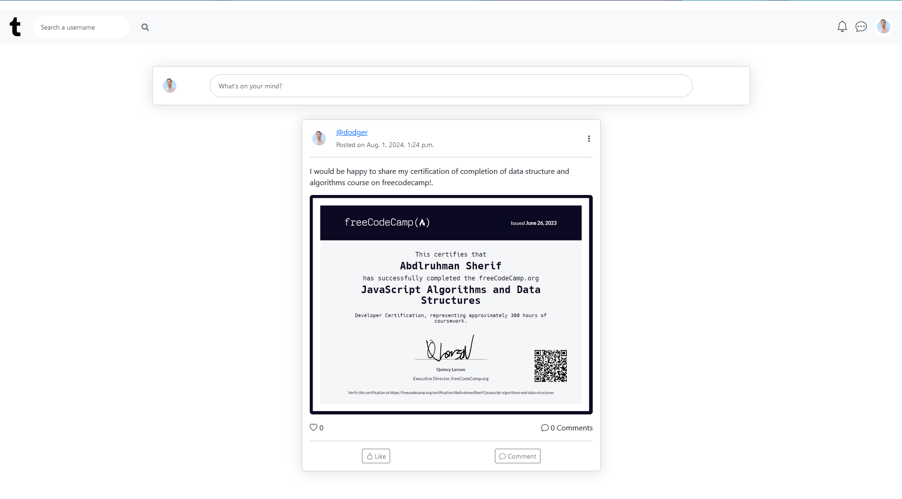
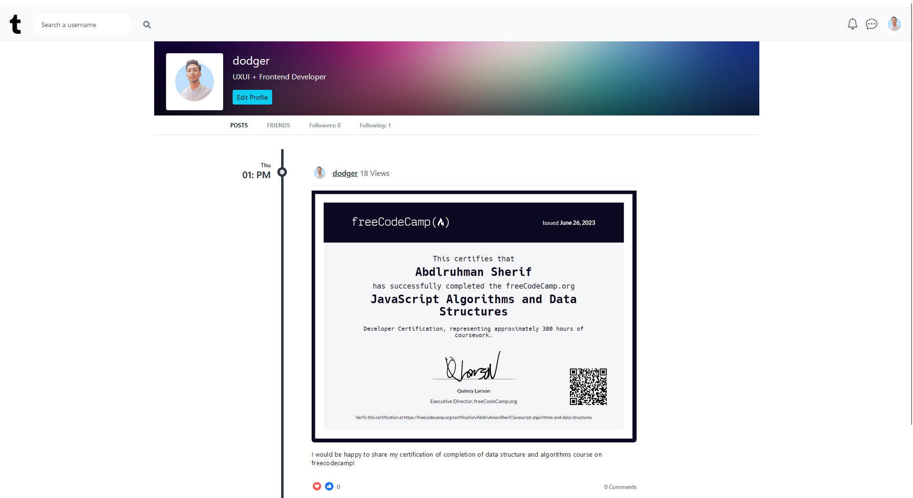
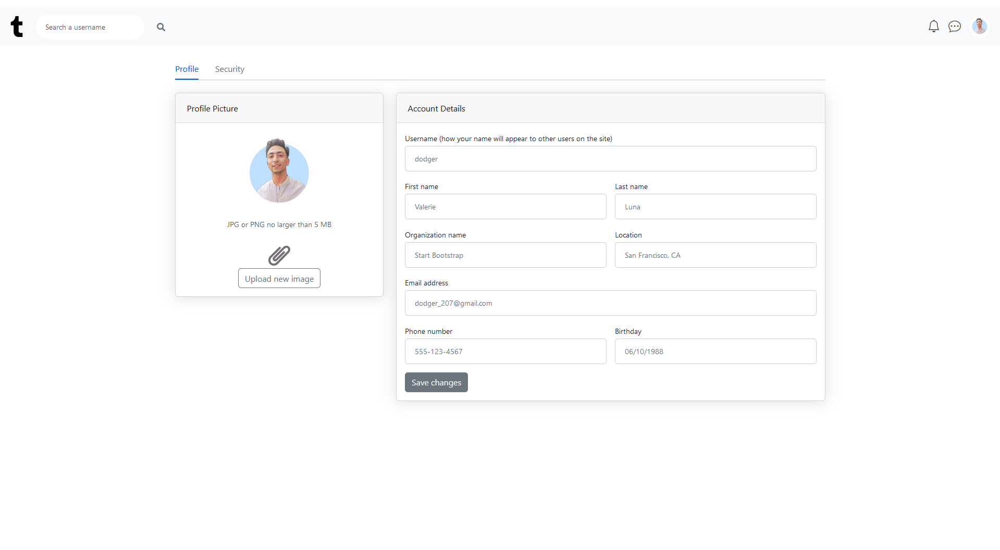
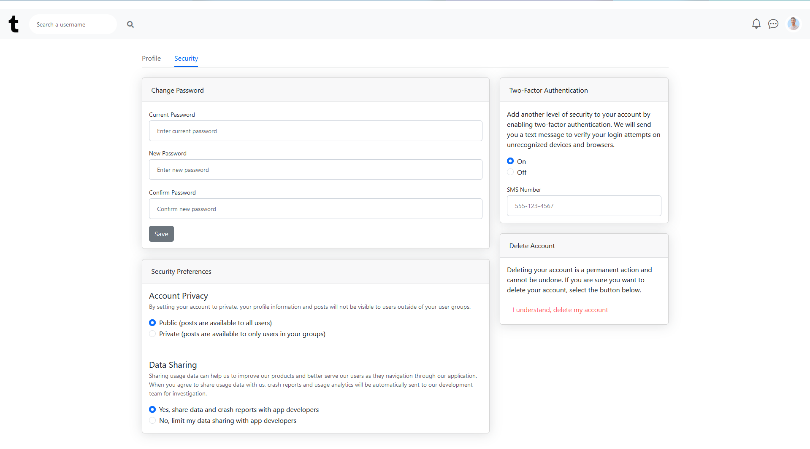
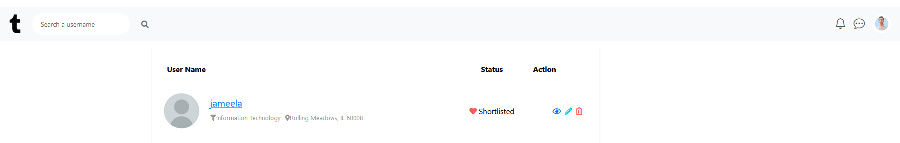

# Django Social Media App

## **Description**

The Django Social Media App is a feature-rich social media platform developed with Django. It provides users with an engaging experience through profile management, post creation, commenting, liking, and following other users. The app includes a feed that aggregates posts from users in the network, allowing for seamless content consumption and interaction.

## **Features**

- **User Authentication:** Sign up, log in, and log out.
- **User Profiles:** Manage and view user profiles.
- **Post Creation:** Create, view, and delete posts.
- **Comments:** Add and view comments on posts.
- **Likes:** Like and unlike posts.
- **Image Uploads:** Upload and display images with posts.
- **Feed:** A dynamic feed that displays posts from users you follow.
- **Follow/Unfollow:** Follow and unfollow other users.
- **Responsive Design:** Optimized for various devices and screen sizes.

## **Installation**

1. **Clone the repository:**

   ```bash
   git clone https://github.com/Abdlruhmann/Django_Social_Media_App.git

    Navigate to the project directory:

2. **Create/Activate the enviroment:**
    ```bash
        cd Django_Social_Media_App

        Create and activate a virtual environment:

    
        python -m venv env
        source env/bin/activate   # On Windows use: .\env\Scripts\activate

        Install the required packages:

3. **Install requirments:**
    ```bash
            pip install -r requirements.txt

4. **Apply migrations:**

    ```bash

        python manage.py migrate
        Create a superuser (optional but recommended for admin access):


5. **Run development server:**
    ```bash
        python manage.py runserver
        Open your browser and go to:
        http://127.0.0.1:8000/


## **App Examples**

1. **Login Page:**
    
2. **Create New Post:**
    
3. **Feed:**
    
4. **Profile Page:**
    
5. **Edit Profile:**
    
6. **Profile Settings:**
    
7. **Search a user:**
    


## **Acknowledgements**

- **Django** for providing the framework

- **Bootstrap** for styling and responsiveness

- **Pillow** for image uploading